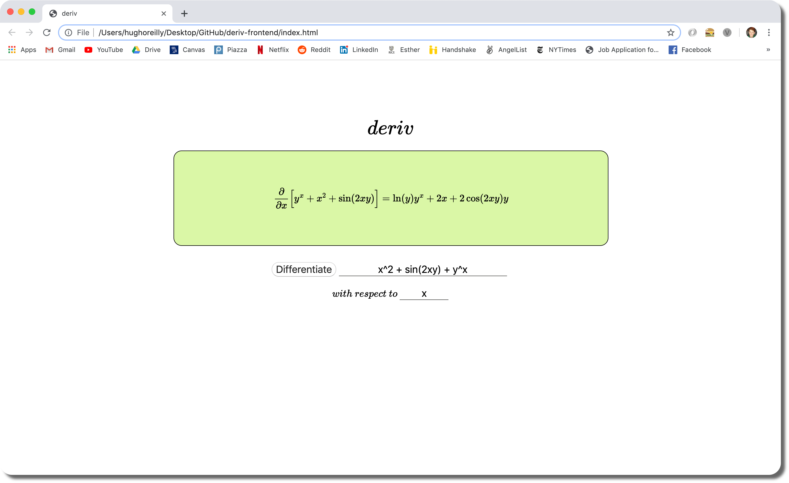

# deriv-frontend

A frontend to interact with the deriv REST API.

## How to run
- Start the [deriv REST API](https://www.github.com/horeilly1101/deriv) on your machine
- Ensure `index.html`, `styles.css`, and `scripts.js` are in the same directory
- Open `index.html` in the browser
